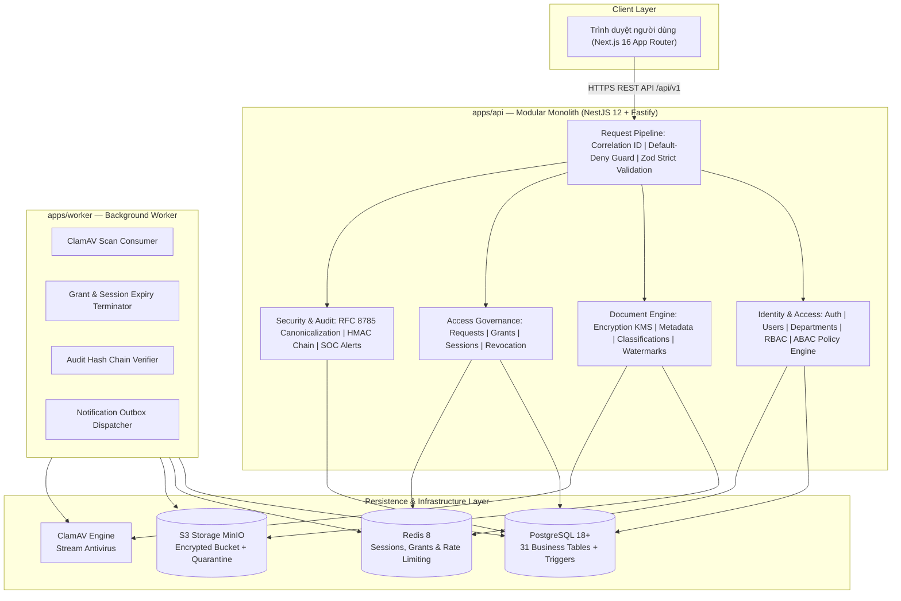

# HỆ THỐNG QUẢN LÝ TRUY CẬP TÀI LIỆU MẬT TRONG TỔ CHỨC

## Secure Document Access & Governance System (SDA v1.0.0)

> 📘 **TÀI LIỆU MÔN HỌC CHUẨN**: Vui lòng tham khảo bản đặc tả chuẩn môn **Phân tích và Thiết kế Hệ thống Thông tin (PTTKHT - PTIT)** tại [README.md gốc của dự án](file:///D:/PTVTKHT/README.md).  
> 📊 **BÁO CÁO HIỆN TRẠNG ĐỒ ÁN**: Đọc báo cáo chi tiết các nội dung ĐÃ LÀM ĐƯỢC và CHƯA LÀM ĐƯỢC tại [docs/BAO_CAO_DANH_GIA_DU_AN_PTTKHT.md](file:///D:/PTVTKHT/secure-document-access-system/docs/BAO_CAO_DANH_GIA_DU_AN_PTTKHT.md).

Hệ thống Quản Lý Truy Cập Tài Liệu Mật Trong Tổ Chức (SDA) là nền tảng an ninh doanh nghiệp cấp cao (Enterprise B2B Security & Governance Platform), được thiết kế chuyên biệt để bảo vệ, phân loại, kiểm soát truy cập và kiểm toán vòng đời các tài liệu tối mật theo kiến trúc Zero Trust, nguyên tắc quyền tối thiểu (Least Privilege) và phân tách trách nhiệm tuyệt đối (Separation of Duties - SoD).

---

## 1. MỤC TIÊU & NGUYÊN TẮC AN NINH CỐT LÕI

Hệ thống được xây dựng nhằm đáp ứng các tiêu chuẩn an ninh quốc tế (ISO/IEC 27001:2022, NIST SP 800-53 Rev. 5) và các quy định pháp luật về bảo vệ bí mật nhà nước và thông tin nội bộ:

1. **Mặc định từ chối (Default-Deny)**: Mọi yêu cầu truy cập tài nguyên (đọc metadata, tải xuống, xem trước, chỉnh sửa) mặc định bị chặn nếu không có chính sách (Policy) hoặc quyền hạn (Grant) hợp lệ đang kích hoạt.
2. **Kiểm soát truy cập kết hợp RBAC & ABAC**:
   - **RBAC (Role-Based Access Control)**: Quản lý quyền hạn thô theo 5 vai trò chức năng riêng biệt.
   - **ABAC (Attribute-Based Access Control)**: Đánh giá ngữ cảnh động (phòng ban, cấp độ thẩm tra, thời gian, dải IP, mức độ tin cậy thiết bị, MFA) theo thuật toán **Deny-Overrides** (từ chối ưu tiên).
3. **Mô hình bảo mật đa mức Bell-LaPadula**: Thực thi nguyên tắc bảo vệ thông tin mật: không đọc vượt cấp (No Read Up) và không ghi hạ cấp (No Write Down).
4. **Mã hóa phong bì số & Quản lý khóa phần cứng (Envelope Encryption with Pluggable HSM/KMS)**: Mỗi tài liệu được mã hóa xác thực bằng khóa DEK (Data Encryption Key) độc lập qua thuật toán **AES-256-GCM**. Khóa DEK được bọc (wrapped) bằng khóa KEK thông qua kiến trúc Pluggable KMS Provider hỗ trợ đa môi trường: phần mềm nội bộ (Local KMS), thiết bị phần cứng **Hardware Security Module (HSM)** chuẩn **OASIS PKCS#11 / FIPS 140-2 Level 3** (thuật toán RFC 3394 `CKM_AES_KEY_WRAP`), HashiCorp Vault Transit Engine và AWS KMS. Hỗ trợ định tuyến giải mã tự động và xoay vòng khóa không downtime (`rotateKeyRef`).
5. **Chèn dấu bản quyền pháp chứng động (Dynamic Forensic Watermarking & Office Pipeline)**: Khi xem hoặc tải tài liệu, hệ thống tự động gắn watermark không thể xóa mờ gồm: mã định danh người truy cập, địa chỉ IP nguồn, dấu thời gian UTC, mã phiên làm việc và mã xác thực HMAC Token (kèm mã QR truy vết nguồn gốc khi rò rỉ). Với các tệp văn phòng Office (`.docx`, `.xlsx`, `.pptx`), pipeline ngầm Gotenberg (LibreOffice headless) tự động render sang PDF có kiểm tra an ninh chặn VBA/SSRF trước khi đưa qua Watermark Engine để người dùng xem trực tiếp trong Sandbox trình duyệt.
6. **Nhật ký kiểm toán bất biến (Tamper-Evident HMAC-SHA256 Chain)**: Toàn bộ thao tác nhạy cảm được chuẩn hóa theo chuẩn RFC 8785 (JSON Canonicalization Scheme) và liên kết thành chuỗi hash bất biến HMAC-SHA256. Mọi hành vi sửa đổi hoặc xóa nhật ký đều bị phát hiện tức thì.
7. **Phân tách trách nhiệm tuyệt đối (Separation of Duties - SoD)**: Quản trị viên kỹ thuật (System Admin) chỉ quản trị tài khoản và hạ tầng, tuyệt đối không có quyền xem hay tải nội dung tài liệu mật. Kiểm toán viên (Auditor) chỉ có quyền đọc nhật ký và báo cáo, không thể can thiệp dữ liệu hay tạo sự cố.
8. **Quét mã độc dòng dữ liệu thời gian thực (ClamAV Stream Ingestion)**: Mọi tệp tải lên đều được kiểm tra chữ ký mã độc, magic bytes thực tế, giải nén phòng chống Zip Bomb / Zip Slip và cách ly ngay lập tức vào vùng Quarantine nếu phát hiện mối đe dọa.
9. **Kiểm soát tranh chấp phân tán Redlock & Khóa lai hai tầng (Two-Tier Hybrid Concurrency Control)**: Triển khai thuật toán khóa phân tán Redlock trên cụm Redis Cluster (Quorum $N/2 + 1$, script Lua nguyên tử giải phóng/gia hạn, bù trừ trượt đồng hồ) ở tầng ứng dụng, kết hợp khóa hàng dọc PostgreSQL `SELECT ... FOR UPDATE` ở tầng CSDL để triệt tiêu hoàn toàn race condition khi tải phiên bản đồng thời hoặc phê duyệt yêu cầu truy cập.
10. **Xác thực đa yếu tố nâng cao FIDO2 / WebAuthn & Khóa vật lý (Phishing-Resistant MFA)**: Hỗ trợ xác thực đa yếu tố đa tầng kết hợp mật khẩu Argon2id, mã thời gian TOTP (Google/Microsoft Authenticator), mã phục hồi khẩn cấp (Recovery Codes), và khóa bảo mật phần cứng cắm cổng USB/NFC chuẩn **FIDO2 / WebAuthn Level 3** (YubiKey, Google Titan Key) cùng sinh trắc học Passkeys (Touch ID, Face ID, Windows Hello). Tích hợp cơ chế chống sao chép khóa (Clone Detection) qua bộ đếm Authenticator Counter, tự động kích hoạt cảnh báo an ninh mức CRITICAL khi phát hiện khóa bị làm giả hoặc replay.
11. **Trình biên tập chính sách ABAC trực quan kéo thả & Trình giả lập PDP (Visual Policy Builder & Live Simulator)**: Giao diện trực quan No-Code Drag-and-Drop mô hình hóa cây logic Disjunctive Normal Form (DNF: Groups OR $\rightarrow$ Conditions AND), tích hợp bảng Palette 15 thuộc tính Subject/Resource/Environment, thư viện 5 mẫu chính sách an ninh dựng sẵn, quản lý Obligations bắt buộc (Watermark, MFA, Forbid Download, No Cache, Max Session Minutes), đồng bộ hai chiều Lossless JSON AST, và trình giả lập PDP thời gian thực kiểm thử tức thì kết quả PERMIT/DENY cùng reason code và obligations theo phong cách giao diện phẳng chuẩn hệ thống.
12. **Phòng chống thất thoát dữ liệu tầng mạng (Network DLP Gateway qua ICAP Server RFC 3507)**: Mở rộng worker triển khai máy chủ ICAP Server (Internet Content Adaptation Protocol - RFC 3507) bản địa trên cổng TCP tiêu chuẩn `1344`. Tích hợp trực tiếp với các thiết bị mạng Gateway DLP chuyên dụng (Symantec DLP Network Prevent for Web, Forcepoint, Squid Proxy, F5 BIG-IP, BlueCoat ProxySG) để phân tích, phát hiện và ngăn chặn rò rỉ dữ liệu ra ngoài Internet (Egress Traffic). Động cơ DLP Engine quét 5 lớp vi phạm: Cấp mật (Tuyệt Mật/Tối Mật/Top Secret), Mã thủy ấn pháp chứng rò rỉ (`WM-[a-f0-9]{48}`), Khóa bí mật PEM / AWS Key / GitHub PAT, Thẻ thanh toán quốc tế (xác thực thuật toán Luhn Checksum), Số Căn cước công dân 12 số và từ khóa nhạy cảm tùy biến. Cơ chế chuyển tiếp sạch `204 No modifications` đảm bảo zero-latency; khi vi phạm trả về `ICAP 200 OK` bọc `HTTP 403 Forbidden` kèm trang cảnh báo an ninh SDA và tự động ghi nhận bản ghi cảnh báo `SecurityAlert` trong CSDL.

---

## 2. NĂM VAI TRÒ NGHIỆP VỤ (SYSTEM PERSONAS)

Hệ thống phân định 5 không gian làm việc (Workspaces) biệt lập tương ứng với 5 vai trò trong tổ chức:

| Vai trò (Role)             | Định danh kỹ thuật | Phạm vi trách nhiệm chính                                                                                                                                         | Giới hạn phân tách quyền (SoD)                                                                     |
| :------------------------- | :----------------- | :---------------------------------------------------------------------------------------------------------------------------------------------------------------- | :------------------------------------------------------------------------------------------------- |
| **Chủ sở hữu tài liệu**    | `DOCUMENT_OWNER`   | Tải lên tệp mật, phân loại mức độ mật, thiết lập chính sách truy cập ABAC, xét duyệt yêu cầu cấp quyền và thu hồi quyền tức thì.                                  | Chỉ quản lý tài liệu thuộc quyền sở hữu hoặc được ủy quyền; không can thiệp cấu hình hệ thống.     |
| **Người đọc tài liệu**     | `DOCUMENT_READER`  | Tìm kiếm danh mục tài liệu công khai (Discovery), gửi yêu cầu cấp quyền truy cập kèm lý do nghiệp vụ, xem tài liệu an toàn trong Sandbox có watermark.            | Không thể xem nội dung tệp khi chưa có Grant hợp lệ; không tải được tệp mức Tối mật/Tuyệt mật.     |
| **Sĩ quan an ninh SOC**    | `SECURITY_OFFICER` | Giám sát cảnh báo vi phạm chính sách theo thời gian thực, điều tra truy vết xuất xứ watermark bị lộ, xử lý sự cố an ninh và cấu hình ngưỡng phát hiện bất thường. | Không có quyền sở hữu tài liệu kinh doanh; tập trung hoàn toàn vào giám sát an toàn thông tin.     |
| **Kiểm toán viên độc lập** | `AUDITOR`          | Xác minh tính toàn vẹn chuỗi băm nhật ký HMAC-SHA256, phát hiện lỗ hổng chuỗi kiểm toán, xuất hồ sơ kiểm toán định dạng CSV/JSON chống sửa đổi.                   | Quyền chỉ đọc tuyệt đối (Strictly Read-Only); không được phép tạo, sửa hay xóa bất kỳ bản ghi nào. |
| **Quản trị viên hệ thống** | `SYSTEM_ADMIN`     | Quản trị danh mục người dùng, sơ đồ phòng ban, gán vai trò RBAC, cấu hình thuộc tính ABAC, mẫu dấu bản quyền và theo dõi tình trạng dịch vụ.                      | **KHÔNG có quyền xem nội dung tài liệu**, không có quyền tải tệp mật, không được tự cấp quyền đọc. |

---

## 3. NĂM CẤP ĐỘ PHÂN LOẠI MẬT CỦA TÀI LIỆU

Mọi tài liệu khi đưa vào hệ thống bắt buộc phải được gắn một trong 5 cấp độ mật với các chế độ bảo vệ tăng dần:

| Cấp độ mật    | Mã phân loại   | Hạng (Rank) | Quy định tải về (Download) | Quy định Watermark    | Cơ chế truy cập mặc định                                                 |
| :------------ | :------------- | :---------- | :------------------------- | :-------------------- | :----------------------------------------------------------------------- |
| **Không mật** | `UNCLASSIFIED` | Cấp 1       | Được phép                  | Tùy chọn              | Toàn bộ nhân viên trong tổ chức có thể tiếp cận.                         |
| **Nội bộ**    | `RESTRICTED`   | Cấp 2       | Được phép                  | Bắt buộc              | Giới hạn trong phòng ban hoặc dự án liên quan.                           |
| **Mật**       | `CONFIDENTIAL` | Cấp 3       | Xét duyệt                  | Bắt buộc              | Yêu cầu cấp độ thẩm tra tối thiểu Cấp 2 và phê duyệt từ Owner.           |
| **Tối mật**   | `SECRET`       | Cấp 4       | **Bị cấm**                 | Bắt buộc (Bảo vệ cao) | Chỉ xem trong Sandbox trình duyệt, cấm in ấn và tải về tệp gốc.          |
| **Tuyệt mật** | `TOP_SECRET`   | Cấp 5       | **Bị cấm**                 | Bắt buộc (Pháp chứng) | Yêu cầu MFA bắt buộc, mạng nội bộ tin cậy, giám sát SOC phiên trực tiếp. |

---

## 4. KIẾN TRÚC KỸ THUẬT & CẤU TRÚC MONOREPO

Hệ thống được kiến trúc theo mô hình **Modular Monolith** kết hợp **Background Worker** bất đồng bộ, quản lý qua Turborepo:



### Cấu trúc thư mục dự án

```text
secure-document-access-system/
├── apps/
│   ├── api/                     # Backend API Monolith (NestJS 12, Fastify, AES-256-GCM, ABAC/RBAC)
│   ├── web/                     # Frontend Web App (Next.js 16, React 19, Tailwind v4, Inter font)
│   └── worker/                  # Background Worker (Xử lý quét mã độc, dọn dẹp phiên, kiểm toán)
├── packages/
│   ├── contracts/               # DTOs, Zod Schemas, Error Codes, Phân loại mật dùng chung
│   ├── database/                # 31 bảng PostgreSQL schema vật lý, Prisma client, Migrations
│   ├── security/                # Policy engine, Zero-Trust guards, Data redaction filters
│   ├── testing/                 # Test utilities, PGlite WASM test harness, Mocks
│   └── config/                  # Cấu hình TypeScript base dùng chung
├── docs/                        # Toàn bộ tài liệu đặc tả, kiến trúc, vận hành và kiểm toán
├── scripts/                     # Scripts tự động hóa: Secrets generation, Infra, Validation, Backup
├── docker-compose.prod.yaml     # Manifest triển khai production chuẩn hóa bảo mật cao
└── infra/                       # Cấu hình Docker Compose môi trường phát triển & Observability
```

---

## 5. QUY CHUẨN THIẾT KẾ GIAO DIỆN (UI & FRONTEND DESIGN SYSTEM)

Giao diện hệ thống tuân thủ nghiêm ngặt **UI & Frontend Design System Rules**:

1. **Typography & Tiếng Việt**:
   - Sử dụng duy nhất font **Inter** nhập khẩu qua `next/font/google` với đầy đủ bộ ký tự `vietnamese`, `latin`, `latin-ext`.
   - Cả `--font-sans` và `--font-display` đều trỏ về `var(--font-inter)`.
   - Loại trừ hoàn toàn hiện tượng **Glyph Fallback** (lỗi méo dấu tiếng Việt hoặc lệch nét chữ).
2. **Hệ thống biểu tượng (Icon System)**:
   - Sử dụng duy nhất thư viện **`lucide-react`**, nét vẽ mảnh `strokeWidth={1.75}` hoặc `2`, màu sắc kế thừa `color="currentColor"`.
   - Kích thước chuẩn hóa: 16px (inline, table actions, tags), 20px (menu điều hướng), tối đa 24px (header/hero).
   - **Tuyệt đối không dùng Emoji**, không dùng hình minh họa trang trí, không gradient trên icon.
3. **Badge, Tag & Trạng Thái (Phong cách "staff-001" phẳng)**:
   - **Tuyệt đối không đóng hộp bo viền capsule** (`background: rgba(...)` + `border`).
   - Chuẩn phẳng tinh gọn: `background: transparent !important; border: none !important; padding: 0 !important;`.
   - **Định danh / Kênh**: Icon 16px + Tên cùng màu tương ứng.
   - **Trạng thái (Statuses)**: Chấm tròn 6px (`.dot`) + Chữ in đậm cùng màu (`success`: `#008A05`, `warning`: `#E07912`, `danger`: `#C13515`, `info`: `#008489`, `primary`: `#FF385C`, `neutral`: `#717171`).
4. **Nút bấm & Tương tác (Interactive Buttons — DEC-012)**:
   - Bo góc chuẩn: `border-radius: 40px` (hoặc `rounded-full`).
   - **Nút Primary**: Tông màu thương hiệu **Full Đỏ `#FF385C`** 100% nguyên khối, chữ trắng đậm, không viền (`border-transparent`). Khi hover: nền chuyển nhẹ sang `#E0294C`, icon mũi tên $\rightarrow$ trượt êm ái sang phải (`translate-x-1`). Triệt tiêu hoàn toàn lỗi chấm đè chữ trên mobile và lỗi khuyết viền trắng.
   - **Nút Outline / Secondary**: Nền trắng, viền mỏng tinh tế `1px solid #dddddd`, chữ đen/xám đậm `#222222`.
   - **Chuyển động mượt**: `transition: all 0.2s cubic-bezier(0.16, 1, 0.3, 1)`, phản hồi chạm tức thì `active:scale-[0.98]`.
5. **Chu vi Bảo mật Giao diện (Frontend Security Perimeter — DEC-013)**:
   - **100% Workspaces** (`/admin`, `/owner`, `/reader`, `/security`, `/auditor`, `/sessions`) được bọc bởi `<AuthGuard requiredRole="...">` chuyên biệt.
   - Tự động chuyển hướng về `/login` với tham số `redirect` khi chưa xác thực; hiển thị màn hình từ chối 403 Forbidden chuẩn mực không rò rỉ dữ liệu khi không đủ quyền vai trò.

---

## 6. YÊU CẦU MÔI TRƯỜNG & HƯỚNG DẪN KHỞI CHẠY (QUICK START)

### Yêu cầu cài đặt trước (Prerequisites)

- **Node.js**: Phiên bản `24.x LTS` (Khuyến nghị: `>= 24.14.0 < 25`).
- **Trình quản lý gói**: `pnpm` phiên bản `12.4.1`.
- **Docker & Docker Compose**: Để chạy PostgreSQL, Redis, MinIO S3 và ClamAV.

### Quy trình khởi chạy từng bước

#### Bước 1: Sao chép mã nguồn và cài đặt phụ thuộc

```bash
cd secure-document-access-system
pnpm install
```

#### Bước 2: Sinh bí mật môi trường phát triển (Zero-Secret)

```bash
pnpm generate-dev-secrets
```

_Lệnh này tự động tạo các khóa mã hóa Ed25519, KMS Master Key (AES-256), Audit HMAC Key và mật khẩu hạ tầng an toàn vào tệp `.env`._

#### Bước 3: Khởi chạy các dịch vụ hạ tầng phụ thuộc

```bash
pnpm infra:up
```

_Khởi động Docker containers: PostgreSQL (cổng 5432), Redis (cổng 6379), MinIO S3 (cổng 9000/9001), ClamAV Daemon (cổng 3310)._

#### Bước 4: Khởi tạo lược đồ cơ sở dữ liệu và dữ liệu mẫu

```bash
pnpm db:migrate
pnpm db:seed
```

_Thiết lập 31 bảng cơ sở dữ liệu, các trigger kiểm toán bất biến, hàm băm và nạp 5 tài khoản mẫu._

#### Bước 5: Khởi động máy chủ phát triển (Development Server)

```bash
pnpm dev
```

- **Web App**: `http://localhost:3000`
- **REST API**: `http://localhost:4000/api/v1`
- **Tài liệu OpenAPI / Swagger**: `http://localhost:4000/api/docs`
- **MinIO Console**: `http://localhost:9001` (Tài khoản: xem trong tệp `.env`)

---

## 7. DANH SÁCH TÀI KHOẢN MẪU DÙNG THỬ (DEMO ACCOUNTS)

Hệ thống cung cấp sẵn các tài khoản demo đại diện cho 5 không gian vai trò:

| Tên tài khoản   | Vai trò nghiệp vụ  | Phòng ban                      | Cấp độ thẩm tra      | Mật khẩu mặc định       |
| :-------------- | :----------------- | :----------------------------- | :------------------- | :---------------------- |
| `owner.demo`    | `DOCUMENT_OWNER`   | Khối văn phòng (`HEAD_OFFICE`) | `SECRET` (Cấp 3)     | Được cấp qua seed / CLI |
| `reader.demo`   | `DOCUMENT_READER`  | Khối văn phòng (`HEAD_OFFICE`) | `INTERNAL` (Cấp 1)   | Được cấp qua seed / CLI |
| `security.demo` | `SECURITY_OFFICER` | Phòng An toàn thông tin        | `TOP_SECRET` (Cấp 4) | Được cấp qua seed / CLI |
| `auditor.demo`  | `AUDITOR`          | Phòng An toàn thông tin        | `SECRET` (Cấp 3)     | Được cấp qua seed / CLI |
| `admin.demo`    | `SYSTEM_ADMIN`     | Khối văn phòng (`HEAD_OFFICE`) | Quản trị kỹ thuật    | Được cấp qua seed / CLI |

---

## 8. BỘ KIỂM THỬ & CỔNG CHẤT LƯỢNG (CI/CD QUALITY GATES)

Dự án áp dụng quy chuẩn kiểm thử nghiêm ngặt. Toàn bộ mã nguồn trước khi tích hợp đều phải vượt qua 100% các cổng kiểm tra sau:

```bash
# Kiểm tra định dạng mã nguồn (Prettier)
pnpm format:check

# Kiểm tra cú pháp và quy tắc tĩnh (Oxlint)
pnpm lint

# Kiểm tra tĩnh kiểu dữ liệu trên toàn bộ 8 gói (TypeScript)
pnpm typecheck

# Chạy toàn bộ 343 unit, domain & worker tests (Node test runner + Fastify + Worker ICAP)
pnpm test

# Kiểm thử tích hợp database, S3 và Redis (PGlite / Testcontainers)
pnpm test:integration

# Kiểm thử hạ tầng và kịch bản file nguy hiểm (EICAR, Zip bomb, MIME fake)
pnpm test:infra

# Xác thực lược đồ vật lý 31 bảng và tính bất biến của trigger
pnpm db:validate

# Quét phát hiện rò rỉ bí mật và lỗ hổng phụ thuộc bảo mật
pnpm security:scan

# Biên dịch gói sản xuất (Production Build)
pnpm build
```

---

## 9. TRIỂN KHAI MÔI TRƯỜNG SẢN XUẤT (PRODUCTION DEPLOYMENT)

Để triển khai ứng dụng trên môi trường máy chủ sản xuất với cấu hình bảo mật container tối đa:

```bash
# 1. Chuẩn bị tệp cấu hình sản xuất
cp docker-compose.production.example.yaml docker-compose.prod.yaml

# 2. Sinh biến môi trường sản xuất (Non-Root, Hardened Keys)
node scripts/generate-dev-secrets.mjs --prod > .env.production
chmod 600 .env.production

# 3. Khởi động các container hạ tầng nền tảng
docker compose --env-file .env.production -f docker-compose.prod.yaml up -d postgres redis minio clamav

# 4. Thực thi migration database
docker compose --env-file .env.production -f docker-compose.prod.yaml run --rm api pnpm db:migrate

# 5. Khởi động toàn bộ cụm dịch vụ ứng dụng
docker compose --env-file .env.production -f docker-compose.prod.yaml up -d
```

---

## 10. BẢN ĐỒ TÀI LIỆU DỰ ÁN (DOCUMENTATION MAP)

Để tìm hiểu chi tiết từng khía cạnh kỹ thuật, vui lòng tham khảo các tài liệu chuyên sâu trong thư mục `docs/`:

- [docs/01-requirements.md](file:///D:/PTVTKHT/secure-document-access-system/docs/01-requirements.md): Đặc tả yêu cầu chức năng (FR01-FR20) và phi chức năng (NFR).
- [docs/03-business-rules.md](file:///D:/PTVTKHT/secure-document-access-system/docs/03-business-rules.md): Quy tắc nghiệp vụ chi tiết (BR01-BR20) và quy tắc dữ liệu (D-BR01-D-BR20).
- [docs/06-api-contract.md](file:///D:/PTVTKHT/secure-document-access-system/docs/06-api-contract.md): Hợp đồng giao tiếp REST API, mã lỗi và định dạng lỗi chuẩn.
- [docs/ARCHITECTURE.md](file:///D:/PTVTKHT/secure-document-access-system/docs/ARCHITECTURE.md): Tài liệu thiết kế kiến trúc hệ thống, ranh giới module và luồng dữ liệu.
- [docs/DEPLOYMENT.md](file:///D:/PTVTKHT/secure-document-access-system/docs/DEPLOYMENT.md): Hướng dẫn chi tiết triển khai máy chủ sản xuất và cấu hình bảo mật.
- [docs/USER_GUIDE.md](file:///D:/PTVTKHT/secure-document-access-system/docs/USER_GUIDE.md): Cẩm nang hướng dẫn sử dụng chi tiết cho từng vai trò người dùng.
- [docs/DEMO_SCRIPT.md](file:///D:/PTVTKHT/secure-document-access-system/docs/DEMO_SCRIPT.md): Kịch bản trình diễn tương tác 10-15 phút minh họa luồng nghiệp vụ.
- [docs/BACKUP_RESTORE.md](file:///D:/PTVTKHT/secure-document-access-system/docs/BACKUP_RESTORE.md): Quy trình sao lưu, diễn tập phục hồi thảm họa và kiểm toán toàn vẹn.
- [docs/KEY_ROTATION.md](file:///D:/PTVTKHT/secure-document-access-system/docs/KEY_ROTATION.md): Quy trình luân chuyển khóa mã hóa KMS, JWT Token và Audit HMAC.
- [docs/INCIDENT_RESPONSE.md](file:///D:/PTVTKHT/secure-document-access-system/docs/INCIDENT_RESPONSE.md): Quy trình ứng phó sự cố an ninh thông tin và điều tra forensic.
- [docs/UI_DESIGN_SYSTEM.md](file:///D:/PTVTKHT/secure-document-access-system/docs/UI_DESIGN_SYSTEM.md): Quy chuẩn thiết kế giao diện, typography Inter và phong cách "staff-001".
- [docs/TRACEABILITY_MATRIX.md](file:///D:/PTVTKHT/secure-document-access-system/docs/TRACEABILITY_MATRIX.md): Ma trận đối chiếu yêu cầu nghiệp vụ với các bộ kiểm thử tự động.
- [docs/decision-log.md](file:///D:/PTVTKHT/secure-document-access-system/docs/decision-log.md): Nhật ký các quyết định kiến trúc, bảo mật và logic nghiệp vụ (DEC-001 đến DEC-013).
- [docs/BUG_FIX_REPORT.md](file:///D:/PTVTKHT/secure-document-access-system/docs/BUG_FIX_REPORT.md): Báo cáo tổng hợp kiểm toán, khắc phục các sai lệch kiến trúc và củng cố hệ thống.
- [docs/BAO_CAO_DANH_GIA_DU_AN_PTTKHT.md](file:///D:/PTVTKHT/secure-document-access-system/docs/BAO_CAO_DANH_GIA_DU_AN_PTTKHT.md): Báo cáo đánh giá toàn diện những thứ đã làm được và chưa làm được của dự án.
- [README.md gốc (Chuẩn môn PTTKHT PTIT)](file:///D:/PTVTKHT/README.md): Bản đặc tả đồ án chuẩn mực theo giáo trình Phân tích & Thiết kế Hệ thống Thông tin.
- [RELEASE_CHECKLIST.md](file:///D:/PTVTKHT/secure-document-access-system/RELEASE_CHECKLIST.md): Danh mục kiểm tra điều kiện phát hành phiên bản chính thức v1.0.0.
